# Pravidla hry
## Obsah

- [Pravidla hry](#pravidla-hry)
  - [Obsah](#obsah)
  - [Ekonomika hry](#ekonomika-hry)
  - [Týmy](#týmy)
  - [Peníze](#peníze)
  - [Stanice](#stanice)
    - [Centrální stanice](#centrální-stanice)
    - [Těžba](#těžba)
  - [Lodě:](#lodě)
    - [Level pilota](#level-pilota)
  - [Lodní moduly:](#lodní-moduly)
    - [Nákladní prostor](#nákladní-prostor)
    - [Bonus do těžby](#bonus-do-těžby)
    - [Zbraně](#zbraně)
    - [Štíty](#štíty)
    - [Pohon lodi](#pohon-lodi)
  - [Souboj](#souboj)
  - [Závěr](#závěr)
  - [Zdroje:](#zdroje)

## Ekonomika hry
Délky hry je předpokládaná na 3h+, za tu dobu by mohl jeden hráč v průměru udělat 700 cviků (sedů).

700 / (3*60) = cca 4 dřepy za minutu

32/5= cca 6 lidí na tým

6*700 = 4200 dřepů na tým za celou hru

Růst ceny pro moduly surovin:

| Úroveň |	1 |	2|	3|	4|	5|
|-------|---|---|---|---|---|
| Cena v surovinách	| 5	| 7	| 15	| 30	| 45	|

Růst ceny pro ostatní moduly:

| Úroveň |	1 |	2 |	3 |
|--------|----|-----|-----|
| Cena v surovinách |	5 |	10  | 20  |

## Týmy
Hraje se v týmech. Každý tým se skládá z 5-6 hráčů. Jeden z nich je pomyslný kapitán a ten má na své lodi posádku. Posádka nesmí opustit loď nikde jinde než na vesmírných stanicích. Pokud se přesouvají mezi stanicemi, tak se musí všichni “držet” aby zůstali na jedné lodi. 
Na stanici se posádka může pohybovat volně, k těžbě s bonusy je však potřeba přítomnost lodi. 
Když si někdo z týmu udělá pilotní licenci, tak může létat vlastní lodí s moduly a posádkou. Posádka (členové týmu) se pak může přesouvat mezi těmito loděmi. 

## Peníze 
Univerzální surovina, jediná která se stackuje. Vše se dá s penězi vyřešit. Nelze ji ukrást.

## Stanice
Po mapě jsou rozmístěné stanice, které nabízejí prodej různých lodních modulů. Také se v jejich blízkosti dají těžit různé suroviny. Poskytují bezpečí před piráty. 
Pro nákup modulu jsou potřeba různé suroviny, tak aby byla nutnost se přemístit mezi stanicemi pro více surovin. Mezi stanicemi jsou převáženy suroviny. Výkupní cena se rovin je vždy nejnižší na stanici, kde se těží. 
Stanice jsou stylizovaná výzdobou podle ras ze Starboundu. 

### Centrální stanice
Aka suchý dok, obsahuje depo a skladiště pro jednotlivé týmy. Je zde umístěné místo pro obchodování s lodními moduly. 
(3+1, tři základní suroviny a peníze)
Základní suroviny:
- Titan	
- Krystaly	
- Minerály	

| Titan | Krystaly | Minerály |
|------|----------|----------|
|  |  |  |

Pro každou surovinu jsou specifické moduly a bonusy. Bonus na lodi lze vždy aplikovat jen na jednoho člověka, který danou surovinu těží. Kosmonauti mohou “nést” neomezené množství surovin, pokud jsou mimo loď. 

### Těžba
Každá herní surovina se získává jiným způsobem na příslušné těžební stanici.
- Krystaly - Lezec
- Minerály - Dřepy
- Titan - Skákání panáka

## Lodě:
Několik různých trupů. Hráč má kartu lodi, ta obsahuje zevnitř obraz lodi, který je rozdělený do segmentů. V každém je díra a kancelářská sponka, tyto pole slouží k umístění lodních modulů. Na přední straně bude grafické znázornění lodi. 

### Level pilota
Pět úrovní pilotních licencí. Licence určuje maximální využitelnou úroveň lodi (Licence ze [StarBoundu](https://starbounder.org/Ship_Upgrade) ). Levely se dají získat za plnění questů. Licence je svázaná s člověkem, který ji získal. Nová je vydána vždy jedině proti té staré.

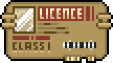
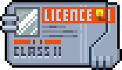
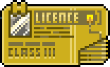
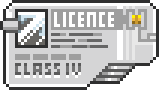
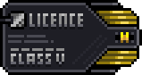

Jakým způsobem pilot získá další úroveň?
    1. Prospěšné práce 1. Nelze prodat, patří jednotlivci!
    2. Prospěšné práce 2. Přines otep dřeva ke společnému ohništi.
    3. Balanc na jedné noze po dobu 3 minut.
    4. Zadrž dech na jednu minutu.
    5. Znalost kosmických lodí.

## Lodní moduly:
- Nákladní prostory
- Těžební 
- Obrané
- Útočné
- Pohon

Každý modul má přesnou cenu surovin za kterou se prodává napříč stanicemi, ale jeho cena co se týče peněz se může lišit. 
Je omezený počet modulů ve hře a mohou tedy dojít. Jakmile na nějaké stanici daný modul dojde, tak se dá koupit na jiné a to zpravidla za vyšší cenu. Hráči tak mohou své nepotřebné moduly v průběhu hry prodávat za vyšší cenu, než je nakoupili. 

### Nákladní prostor
Každé prázdné místo lodi se počítá jako nákladní prostor. Čím více nákladních prostorů na lodi je, tím víc surovin je možné v nákladním prostoru převážet. Kapacita lze rozšířit pomocí modulů rozšiřujících nákladní prostor. 

| Kapacita +2	 | Kapacita +5 |
|------|----------|
|  |  | 

### Bonus do těžby
Každá surovina má své vlastní bonusové moduly, díky tomu se mohou hráči úzce specializovat a následně mezi sebou utvořit obchod s otevřenou ekonomikou. 

### Zbraně
Smí je používat pouze armáda. Dají se však sehnat na některých stanicích. Pokud armáda narazí na některou loď, která má na palubě zbraně, tak je o ně připraví. 

| Zbraně | level 1 | level 2 | level 3 |
|--------|----------|----------|---------|
| Laser	    | 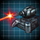 | 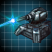 | 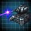 |
| Plazma    | 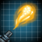 |  | 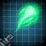 |
| Torpéda   | 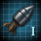 | 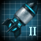 | 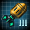 |
| Railgun   | 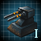 | 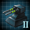 | 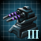 | 

### Štíty
Jsou povolené v plné míře, nepodléhají žádné regulaci a jsou plně legální. 

Typy:
- Plášť
Obrana proti laserům. (+1,+2,+3)

- Magnetické štíty
Proti plazmovým zbraním.

- Protiraketová obrana
Proti torpédům/raketám.

- Pancíř/plátování
Obrana proti kinetickým zbraním (railgun).

| Obrana | level 1 | level 2 | level 3 |
|--------|----------|----------|---------|
| Plášť	    | 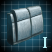 | 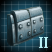 | 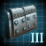 |
| Magnetické štíty    | 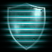 |  | 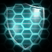 |
| Protiraketová obrana   | 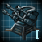 | 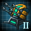 |  |

Triplex
Odrazí laser zpět na útočníka.

### Pohon lodi
Každý loď musí mít alespoň jeden pohon. Piráti nechtějí zničit loď, ale pouze jí vyřadit, aby mohli získat její náklad. Proto míří na trysky. Čím více pohonů loď mí, tím více životy disponuje. (pravidla fair-plundering)

- Chemické trysky +1 život
- Plazmové trysky +2 životy
- Iontový pohon +3 životy

| Chemické trysky | Plazmové trysky | Iontový pohon |
|-----------------|-----------------|----------------|
| 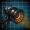 | 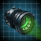 | 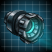 |

## Souboj
Otočící loď zastaví svou oběť dotekem, ta se nesmí souboji bránit. 
Postupně se střídají v palbě dokud mají ještě nějaké nabité zbraňové systémy.
Souboj se skládá z několika kol. Útočník vybírá zbraň pro útok. Jedna strana vždy útočí a druhá se brání. Každý útočný modul se dá použít jen jednou, stejně tak i obranné.
Jeden útok:
1. Výběr zbraně
2. Stříhání zda došlo k zásahu. Pokud se při stříhání podaří zvítězit straně, která se brání, tak se střele vyhnuli. 
3. Obranná opatření, pokud došlo k zásahu (použití obranných modulů). Pokud zvítězí útočník, tak shodí příslušný obranný prvek svého protivníka, pokud ten již žádný takový nemá, tak schytává zásah.
4. Každý zásah ubere lodi tolik životů z pohonů, jaká síla nebyla odbráněna. (Ta bude mít partně jen jeden). 
5. Pokud došlo ke zničení všech životů motorů, tak dojde k nalodění a vítěz si může vybrat kořist (tolik surovin kolik jen uveze).

## Závěr
Hra se povedla. Ekonomika byla spočítána dobře. Příště by měl být větší rozdíl mezi výkupní a nákupní cenou surovin 1 ku 3, aby se účastníci mohli dohodnout na ceně 2 pro jejich vlastní obchod. 
Chyba byla v zakázání utkání lodí před instruktorama, vedlo to k nepoužívání zbraní a neprozkoumaní této herní mechaniky. Na zbraních a obraně nebylo napsáno proti čemu se dají používat. Dva týmy se spojili, ale protože měli moc surovin, ale málo licencí, tak nevyhráli.
Pilotní licence byli vydávány málo striktně a tak vyhrál tým s největším počtem 5 licencí.
Pilotní licence tvořili vlastní "mini hru", která se dětem velmi líbila.

Problém hry byl, že nebavila účastníky, kteří měli celou hru jen dřepovat a nevěděli proč. Byl to předposlední den a bylo po nočce, hra byla mali namotivovana a nahecovana I tým byl unavený.
Příště by to chtělo zajímavější způsob získávání surovin.

Do budoucna se nabízí udělat přístav, který bude jen prodávat zbraně.

## Zdroje:
- http://sit.milaq.net/#tech-detail 
- https://board-cs.darkorbit.com/threads/herna-biblia-abecedny-prehlad-nova-verzia-upravuje-sa.114262/
- https://board-cs.darkorbit.com//threads/laserove-dela.109153/
- https://board-en.darkorbit.com/threads/sc-unofficial-darkorbit-revealed-archive.112857/
- https://stellaris.paradoxwikis.com/Category:Resource_icons

